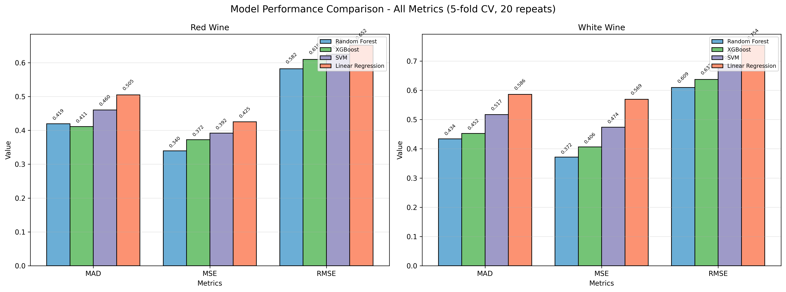
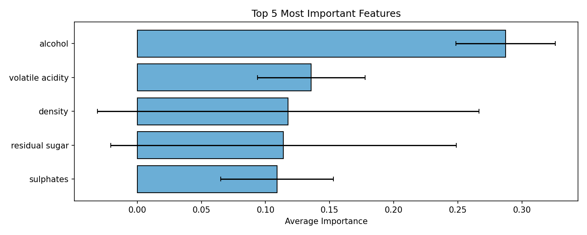

# Wine Quality Prediction with Regression Models

**Team Members:** Chenzi Jin, Alicia Mendoza
**GitHub Repository:** [https://github.com/czjin2025/eco395m-ml-midterm-good-wine](https://github.com/czjin2025/eco395m-ml-midterm-good-wine)

## 1. Problem Statement
This project aims to predict wine quality scores based on physicochemical properties, replicating and extending the study by Cortez et al. (2009). The goal is to develop a regression model that can accurately predict human taste preferences, which traditionally rely on subjective expert evaluation. We compare four different regression techniques to identify the model that best balances predictive accuracy and interpretability.

## 2. Data Understanding

### 2.1. Source and Collection
The dataset is the publicly available **Wine Quality Dataset** from the UCI Machine Learning Repository. It contains physicochemical and sensory data for Vinho Verde wine samples from Portugal. The data was collected between 2004 and 2007 by the official certification entity (CVRVV) and represents a large, real-world sample.

### 2.2. Data Description
We analyze red and white wine variants separately due to their distinct characteristics. The datasets are clean with no missing values.
*   **Red Wine:** 1,599 samples
*   **White Wine:** 4,898 samples

**Input Features (11):**
*   Fixed acidity, volatile acidity, citric acid, residual sugar, chlorides, free sulfur dioxide, total sulfur dioxide, density, pH, sulphates, alcohol.

**Target Variable:**
*   `quality`: Sensory score (median of at least 3 evaluations), ranging from 0 (very bad) to 10 (excellent).

### 2.3. Data Limitations
The target variable is a subjective human score, which introduces inherent variability. While the physicochemical tests are objective, the relationship between these properties and taste is complex and not fully captured by the data alone.

## 3. Methodology

### 3.1. Modeling Approach
We treat wine quality prediction as a regression problem. Four models are implemented and compared:
*   **Linear Regression:** Serves as a baseline interpretable model.
*   **XGBoost:** A powerful, non-linear tree-based ensemble method.
*   **Random Forest:** Another robust tree-based ensemble method.
*   **Support Vector Machine (SVM):** A non-linear model effective in high-dimensional spaces.

### 3.2. Evaluation Protocol
To ensure robust and fair comparison:
*   **Data Preprocessing:** All features are standardized to zero mean and unit variance.
*   **Validation:** We use **5-fold cross-validation repeated 20 times** (100 total experiments per model configuration), as recommended in the original paper to obtain stable performance estimates.
*   **Evaluation Metrics:** Model performance is assessed using standard regression metrics:
    *   **MAD (Mean Absolute Deviation):** Average absolute error.
    *   **MSE (Mean Squared Error):** Penalizes larger errors more heavily.
    *   **RMSE (Root Mean Squared Error):** Error in the same units as the target variable.

## 4. Results and Discussion

### 4.1. Model Performance Comparison
The table below summarizes the cross-validated performance of all models for both red and white wines. Lower values indicate better predictive accuracy.

| Model | Red Wine (MAD) | Red Wine (RMSE) | White Wine (MAD) | White Wine (RMSE) |
| :--- | :---: | :---: | :---: | :---: |
| Linear Regression | 0.505 | 0.652 | 0.586 | 0.754 |
| XGBoost | **0.411** | 0.610 | 0.452 | 0.637 |
| Random Forest | 0.419 | **0.582** | **0.434** | **0.609** |
| SVM | 0.460 | 0.625 | 0.517 | 0.688 |

*Table: Model performance based on 5x20 cross-validation. Best scores for each metric and wine type are highlighted in bold.*

A visual comparison of all three metrics for each wine type is provided below:



*Figure 1: Comparison of MAD, MSE, and RMSE for all models on Red and White wine.*

### 4.2. Feature Importance
Analyzing feature importance across models reveals the key drivers of wine quality. The plot shows the average importance of the top features:



*Figure 2: Average importance of the most influential features across all models.*

**alcohol** is consistently the most important predictor, confirming the oenological theory that higher alcohol content is associated with higher quality. **Volatile acidity**, **density**, **residual sugar**, and **sulphates** also play significant roles.

### 4.3. Comparison with Original Paper
Our results align well with the findings of Cortez et al. (2009). Their reported MAD for Linear Regression was ~0.50 for red wine and ~0.59 for white wine, which closely matches our results (0.505 and 0.586). Our extension with tree-based models (XGBoost, Random Forest) shows improved performance, particularly for red wine, suggesting that non-linear relationships are important.

## 5. Recommendations and Conclusion

Based on the analysis, the recommendation for the best model depends on the wine type:
*   **For Red Wine:** **XGBoost** achieves the lowest MAD (0.411) and is the top performer by this key metric.
*   **For White Wine:** **Random Forest** demonstrates the best overall performance with the lowest MAD (0.434) and RMSE (0.609).

These tree-based ensemble methods capture non-linear interactions that simpler models like Linear Regression miss, leading to more accurate predictions. The analysis confirms the primary importance of alcohol content in determining wine quality.

## 6. Reproducibility

### 6.1. Repository Structure
```
.
├── code/                      # All model scripts
│   ├── linear_model.py
│   ├── xgboost_model.py
│   ├── random_forest.py
│   ├── svm_model.py
│   └── comparison_model.py    # Script to generate final results and plots
├── data/                      # Original datasets (winequality-*.csv)
├── figures/                   # Generated plots (Figure 1 & 2)
├── results/                   # Generated results (CSV files)
├── main.py                    # Core functions (data loading, CV)
├── requirements.txt           # List of dependencies
├── .gitignore
└── README.md
```

### 6.2. Setup Instructions
1.  Clone the repository.
2.  Navigate to the project root.
3.  Create and activate a virtual environment (optional but recommended).
4.  Install required packages:
    ```bash
    pip install -r requirements.txt

### 6.3. Running the Analysis
The entire analysis can be reproduced by running the comparison script from the project root:
```bash
python3 code/comparison_model.py
```
This single script will:
*   Load and preprocess the data.
*   Train and evaluate all four models using 5x20 cross-validation.
*   Save individual model results and a combined summary CSV in the `results/` folder.
*   Generate the performance comparison plot and the feature importance plot in the `figures/` folder.

All paths used in the code are relative, ensuring the analysis runs correctly on any machine once the repository is cloned.

